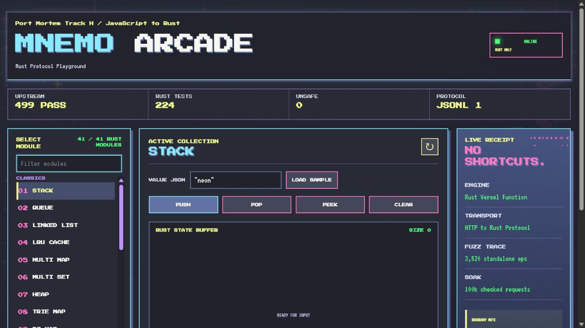

# mnemonist-port

**Port Mortem 2026, Track H: Mnemonist from JavaScript to Rust.**

<p align="center">
  <a href="https://mnemo-arcade-rust.vercel.app"><strong>Play Mnemo Arcade</strong></a>
  &nbsp;|&nbsp;
  <a href="#judge-quickstart"><strong>Run the proof</strong></a>
  &nbsp;|&nbsp;
  <a href="DECISIONS.md"><strong>Read the decisions</strong></a>
</p>



## At A Glance

| Evidence | Reproducible result |
| --- | --- |
| Preserved upstream tests | 42 kickoff-hashed files, **499 passing**, 1 upstream-owned pending |
| Rust verification | **224 passing** release tests |
| Submitted artifact | Rust-only JSONL executable, with no `napi` or `napi-derive` dependency |
| Safety audit | **0 handwritten `unsafe`** blocks, functions, impls, or extern declarations |
| Behavioral evidence | Seeded standalone differential fuzzing, a 100k-request persistent-protocol soak, and p50/p95/p99 plus RSS methodology |
| Live demonstration | [Mnemo Arcade on Vercel](https://mnemo-arcade-rust.vercel.app): 41 Rust protocol modules, executed by Rust serverless functions |

Run `npm run verify:submission` from a fresh checkout to verify the test
manifest, Rust-only executable boundary, zero-unsafe audit, protocol contract,
and unchanged upstream test path. See [SUBMISSION.md](SUBMISSION.md) for the
submission evidence, [DECISIONS.md](DECISIONS.md) for explicit semantic boundaries,
[PLAYGROUND.md](PLAYGROUND.md) for local or Docker demo instructions.

This repository ports the root JavaScript structure files from [Yomguithereal/mnemonist](https://github.com/Yomguithereal/mnemonist) to Rust. Every upstream root `.js` structure file has a Rust counterpart in `src/`, excluding package entrypoints like `index.js`.

## Open Pair Rationale

Mnemonist is a JavaScript data-structure library whose value lies in observable
container behavior: bounded storage, iteration order, promotion and eviction,
and indexing algorithms. Rust is a defensible target because it offers
predictable ownership and memory behavior for those structures while producing
a runnable native executable without a JavaScript runtime dependency. The port
keeps the original tests hash-identical, uses safe Rust by default, and records
where JavaScript-runtime semantics such as arbitrary closures and `WeakMap`
lifecycle notification require an explicit host boundary.

The Track H scope is intentionally the upstream root data-structure modules and
their preserved tests, rather than documentation, benchmarks, examples, or
package-entrypoint glue. This keeps the port centered on the observable
algorithms that make Mnemonist useful: stateful containers, indexing structures,
ordering, search, and bounded-memory behavior.

## Judge Quickstart

```bash
npm run verify:submission
```

Expected result: a runnable Rust-only `mnemonist` executable whose normal
dependency tree excludes `napi`, a zero-unsafe audit, `33` JSONL protocol
contract requests passing, and **499 unchanged upstream assertions** passing
through the standalone executable. The command uses Node only to host the
preserved JavaScript test files; Node is not linked into the artifact.
`make submission-verify` is an equivalent convenience alias where GNU Make is
available.

For the broader compatibility validation, `npm run verify` additionally runs
the hash check, **224** Rust tests, and the complete preserved suite
(`499 passing`, `1` upstream-owned pending). That result is intentionally
reported separately from standalone Rust-only conformance.

## Current Status

- Rust module tree mirrors the upstream root JS structure files.
- `cargo build --release --bin mnemonist` produces a Node-free JSONL protocol runner. It is stateful across stdin requests and currently exposes Stack, Queue, LinkedList, FixedStack, FixedDeque, CircularBuffer, SparseSet, SparseQueueSet, SparseMap, BitSet, StaticDisjointSet, MultiArray, MultiSet, MultiMap, BiMap, Heap, FixedReverseHeap, FibonacciHeap, HashedArrayTree, Set helpers, BloomFilter, and LRU caches without enabling the optional N-API feature.
- Builds cleanly on a standard host toolchain with plain `cargo build` / `make build` — no Windows-only cross-target lock required.
- Rust-native parity tests: **224 passing, 0 failing** (`cargo test --release`), including eight independent Stack/Queue instances under parallel thread load. This checks Rust instance isolation, not a claim that a single JavaScript object has concurrent mutation semantics.
- Original upstream suite: **41 of 41 active module files, 499 passing assertions, 0 failing, 1 preserved upstream-pending test** (`npm run test:original:all-ported`). The pending upstream issue #196 cases run as two passing un-hashed supplemental regressions in `npm run verify`; the original file remains hash-identical.
- Standalone conformance subset: **499 passing unchanged upstream assertions** for every active upstream module file. This route uses the release Rust executable only; it deliberately does not load `mnemonist.node`. Arbitrary JavaScript distance/tokenizer/comparator callbacks, map factories and fuzzy hash callbacks, token-array trie/suffix inputs, interval getters, and BKTree/VPTree non-string values remain explicit adapter fallbacks. Opaque handles preserve JavaScript object identity for Rust-owned map/cache state. DefaultWeakMap uses host `WeakRef`/`WeakMap` retention and records a Rust `release` operation through `FinalizationRegistry` when a key is collected; finalizer scheduling remains host-GC dependent.
- Standalone LRU regressions: `npm run test:standalone:lru` exercises Rust-backed promotion, eviction, ordered iteration, `setpop`, deletion, object identity, and stored `undefined` through the JSONL protocol. JavaScript values cross as opaque handles; Rust owns all LRU state.
- Kickoff test manifest: verified unchanged (`A937FE...25D381`). This is the reproducible SHA-256 manifest for the 42 files in `tests/original`, each byte-for-byte identical to the pinned upstream checkout at `1f2c752`.
- Phase 6 clean-room verification: fresh source-only copy completed `npm install`, `cargo build --release`, `cargo test`, and `npm run test:original:all-ported` successfully.
- Delivery archive: a source-only archive excludes generated build output, dependencies, native binaries, and Git metadata; its extracted contents passed the same clean-room sequence.
- Differential evidence: a seeded 135-second upstream-JS versus N-API campaign completed 21,237,797 synchronized Stack/Queue/LinkedList/FixedStack/FixedDeque/BitVector/LRUCache/LRUCacheWithDelete/typed-Vector operations without divergence in the documented upstream-consistent domains; details are in `fuzz/log.txt` and `UPSTREAM_FINDINGS.md`.
- Standalone differential evidence: a deterministic upstream-Mnemonist versus Rust-executable SymSpell campaign completed 3,200 synchronized add/search/clear operations across four maximum-distance and verbosity modes without divergence. It caught and corrected an initially incorrect optimal-string-alignment distance implementation; the source uses unrestricted Damerau-Levenshtein. Reproduce with `npm run fuzz:standalone-symspell -- --duration-ms=120000 --steps=800 --seed=1592639710`.
- Standalone collection differential evidence: a seeded Stack, Queue, LRUCache, and BitVector campaign completed **320 synchronized operations** against the Rust executable, comparing return values, size, and observable order or bits after every operation. Reproduce with `npm run fuzz:standalone-collections -- --duration-ms=120000 --steps=80 --seed=1592639710`.
- Persistent protocol soak: `npm run soak:standalone -- --requests=100000` drives a single Rust JSONL process through a 100k-request Stack/Queue trace and checks every response and final state.
- Performance evidence: `npm run bench:distribution` refreshes `bench/results.json` with 20 warmed p50/p95/p99 latency samples for Rust core, N-API, upstream Node, startup, a persistent Rust JSONL process handling 10k Stack requests, and separately-defined Node/Rust working-set distributions. `npm run bench:rust-rss` samples Rust `WorkingSet64`/`VmRSS` while a defined retained workload remains live; it is not a peak-RSS claim.
- No handwritten `unsafe` blocks; `npm run check:zero-unsafe` enforces this in `src/` and Rust integration tests.

## Strongest Ported Modules

- Stack, Queue, LinkedList, Vector (standard typed-array path)
- FixedStack, FixedDeque, CircularBuffer
- Heap, Set helpers
- BiMap, MultiSet, SparseSet, BitSet, StaticDisjointSet
- LRUCache, LRUMap, and with-delete variants

## First-Pass Converted Modules

BitVector, BloomFilter, BKTree, CritBitTreeMap, DefaultMap, FibonacciHeap, FixedReverseHeap, FuzzyMap, FuzzyMultiMap, HashedArrayTree, InvertedIndex, KDTree, MultiArray, MultiMap, PassjoinIndex, SparseMap, SparseQueueSet, StaticIntervalTree, SuffixArray, SymSpell, Trie, TrieMap, VPTree, and sort helpers.

All 41 active upstream module tests now run through the local compatibility surface, and the standalone runner executes the Rust-owned path for every active upstream test file. JavaScript remains at explicit boundaries for live callbacks, host finalizer scheduling, arbitrary token arrays, custom backing factories, and exact writable typed-array layouts. The green suite is therefore evidence of public API parity, not a claim that Rust reimplements a JavaScript runtime.

## Submission Artifact

The submitted runnable artifact is `target/release/mnemonist`, built by
`cargo build --release --no-default-features --bin mnemonist`. It is a Rust
executable with no `napi` or `napi-derive` dependency. Run
`npm run verify:submission` (or `make submission-verify`) to enforce that
dependency boundary, build the artifact, run its protocol contract, and execute
the preserved standalone conformance suite. Node is used there only as the
unchanged JavaScript test host; it is not linked to or required by the release
executable.

## Public Reproduction

For a fresh checkout with Rust and Node 22 installed:

```bash
git submodule update --init --recursive
npm ci
npm run verify:submission
```

For the complete recorded evidence sequence, including differential fuzzing and
the persistent-process soak:

```bash
npm run demo:submission
```

The standalone executable can also be built and run in a container without
Node or N-API:

```bash
docker build -t mnemonist-port .
docker run --rm mnemonist-port --version
```

## Interactive Rust Playground

The repository includes a small browser demo for the standalone executable.
It is an interface to the same Rust protocol executor used by the conformance
tests: no N-API addon and no JavaScript implementation are loaded.

```bash
cargo run --release --bin mnemonist -- --web
# open http://127.0.0.1:8787
```

The container exposes the same demo when bound to all interfaces:

```bash
docker build -t mnemonist-port .
docker run --rm -p 8787:8787 -e MNEMONIST_WEB_ADDR=0.0.0.0:8787 mnemonist-port --web
```

## Commands

```bash
make submission-verify # Rust-only artifact, dependency boundary, and standalone evidence
npm run demo:submission # verification plus deterministic standalone differential fuzz
make build           # cargo build --release --bin mnemonist; produces the JSONL runner
make test            # cargo test — the Rust-native parity suite (224 tests)
make build-native    # npm run build:native — compiles mnemonist.node (N-API addon)
make test-original    # npm run test:original:all-ported — builds the addon, then runs
                       # the *unmodified* original JS suite from tests/original/ against it
node target/release/mnemonist --help  # inspect the standalone runner
npm run test:standalone               # protocol contract test (no N-API)
npm run test:original:standalone      # 499 original assertions through Rust executable
npm run soak:standalone -- --requests=100000 # checked persistent-protocol soak
npm run bench:rust-rss                # Rust retained-workload RSS sample
make run
make bench
make hash-tests      # cross-platform (bash on Linux/macOS, PowerShell on Windows)
```

The Rust-only commands run with a stock stable Rust toolchain. On Windows,
`npm run build:native` automatically uses a compatible installed x64 MinGW
toolchain when available (or the configured Rust toolchain otherwise).

## Deliverables

- `src/`: Rust module tree
- `adapter/`, `tests/*.js` (root-level shims): thin JS layer bridging the original
  Mocha suite to the compiled Rust core via N-API
- `src/main.rs`: Node-free, persistent JSONL protocol runner. The optional protocol
  transport in `adapter/_protocol.js` replays JSON-safe core operations so the
  preserved Stack, Queue, LinkedList, FixedStack, FixedDeque, CircularBuffer, and SparseSet tests can exercise that executable without
  loading N-API. It is a conformance transport, not a performance path.
- `tests/original/`: hashed original tests, unmodified
- `tests/*_port.rs`: Rust parity tests
- `bench/results.json`: benchmark smoke results
- `fuzz/log.txt`: fuzz/property smoke log
- `DEMO.md`: reproducible five-minute recording flow using submission commands
- `SUBMISSION.md`: judge-facing artifact, verification, fuzz, benchmark, and boundary evidence
- `evidence/standalone-boundaries.json`: machine-readable statement of Rust ownership and host boundaries
- `UPSTREAM_FINDINGS.md`: independently reproducible upstream behavioral finding
- `DECISIONS.md`: architecture notes
- `.port-mortem.toml`: source/hash metadata

## License

MIT, matching upstream Mnemonist.
